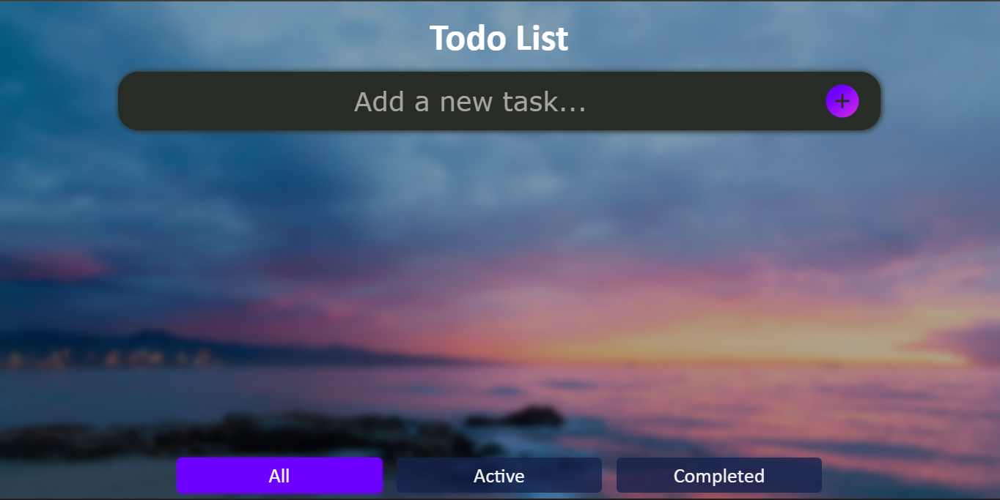
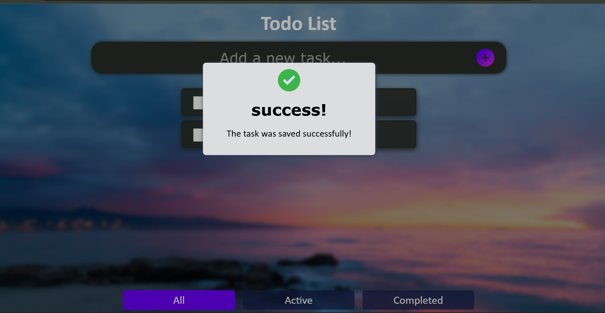
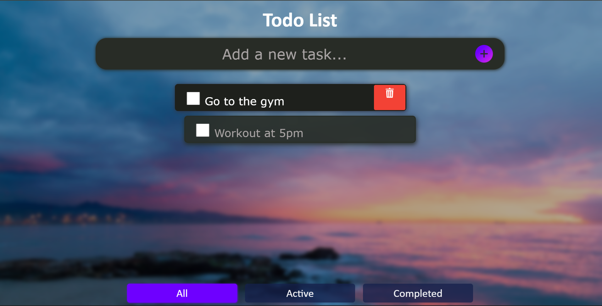
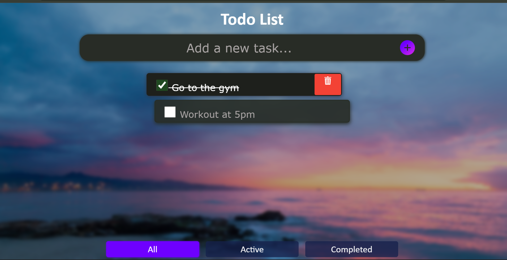
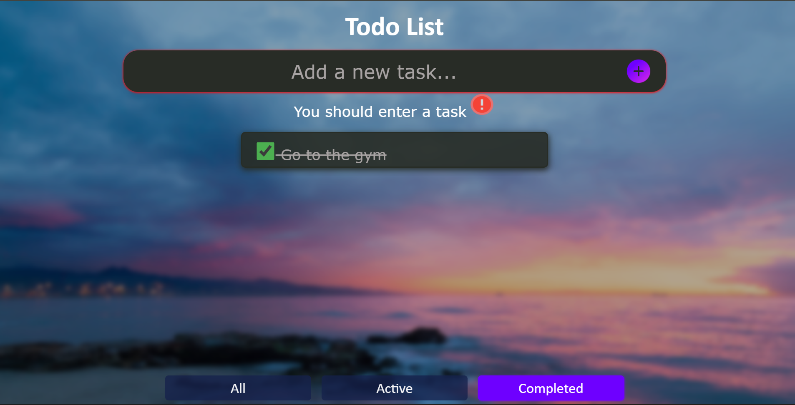
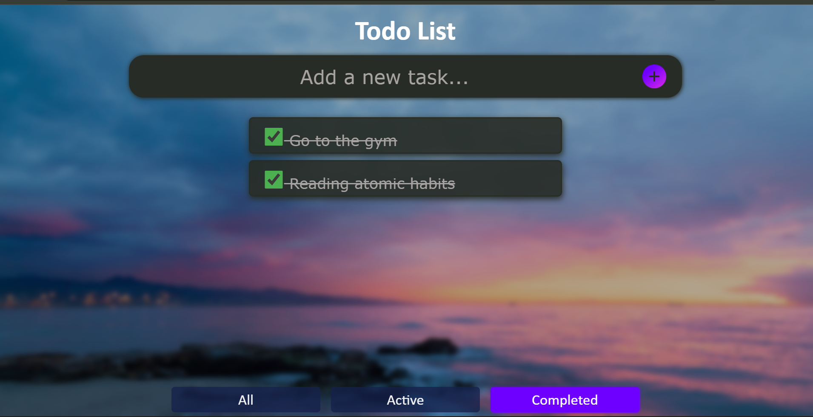

# 📝 To-Do List App (with Local Storage)

A simple and practical To-Do List application built with **HTML, CSS, and JavaScript**. This project focuses on core frontend development concepts such as DOM manipulation, event handling, and data persistence using `localStorage`.

---

## 🚀 Features

* ✅ Add new tasks
* ✔️ Mark tasks as completed
* ❌ Delete tasks
* 💾 Save tasks in browser using `localStorage`
* 🔄 Persist tasks after page reload

---

## 🧠 What I Learned

This project helped me strengthen the following skills:

* Dynamic DOM manipulation
* Handling user input with forms
* Managing application state using JavaScript
* Working with arrays of objects
* Using `localStorage` to persist data
* Writing cleaner and more organized code

---

## 🛠️ Technologies Used

* HTML5
* CSS3
* JavaScript (Vanilla JS)

---

## 📂 Project Structure

```
📁 todo-list-app
│── index.html
│── style.css
│── script.js
│── resources/
```

---

## ⚙️ How It Works

* Tasks are stored as an array of objects:

```js
{
  id: number,
  text: string,
  completed: boolean
}
```

* When a task is added:

  * It is pushed into the array
  * The UI is updated
  * Data is saved to `localStorage`

* When the page loads:

  * Tasks are retrieved from `localStorage`
  * The list is rendered again

---

## 📸 Screenshots







---

## 📌 Future Improvements

* ✏️ Edit tasks
* 🎨 Improve UI/UX design
* 🌙 Dark mode
* 📅 Add due dates

---

## 🧪 How to Run the Project

1. Clone the repository:

```bash
git clone https://github.com/KaliGix/TodoList-App.git
```

2. Open the project folder
3. Run `index.html` in your browser

---

## 📖 Lessons & Reflection

This project represents a key step in my journey as a frontend developer. It goes beyond a simple UI by introducing real-world concepts like state management and data persistence.

---

## 📎 Repository

https://github.com/KaliGix/TodoList-App.git

---

## 🙌 Author

Created by **Kali** as part of a frontend development learning path.
